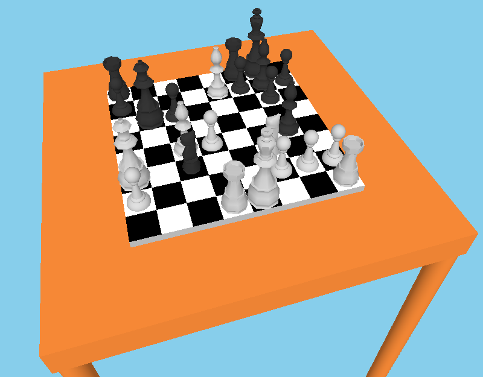

# Chess in OpenGL

An OpenGL C++ implementation of a chess scene.
    

## How to run

* Only tested on Linux. You may need to do some Windows-specific modifications to compile the project there. 
* Required libraries:
    * `GL`
    * `GLUT`
    * `GLEW`
    * `GLM`
* Use `cmake` to build the project: `cmake -G "CodeBlocks - Unix Makefiles" /path/to/ogl-chess`
* Run the output executable `ogl_chess`

## Usage

* Left click and drag mouse to move the camera around
* Use `W`/`S`/`A`/`D` keys to move the camera front and right
* Scroll mouse to zoom
